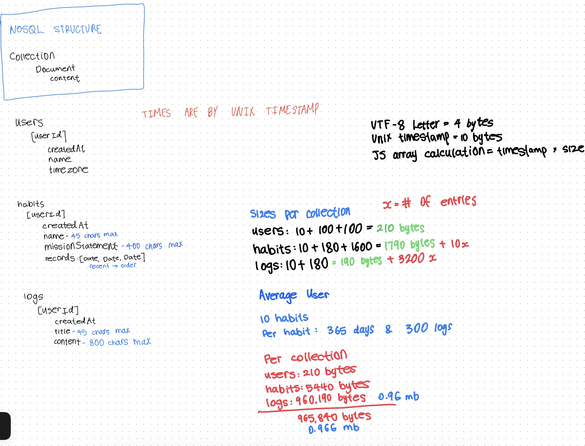

# Habitly - The AI powered habit tracker app

**Made with react and firebase**

## Setup

Install node dependencies

```
npm i
```

Run the app

```
npm run dev
```

Starts up on ```localhost:3000```

## Archetecture

### Google authentication

Powered by firebase authentication

### Firestore NOSQL Database

Firebase free tier limits:

```
1 GiB = 1.07374 GB 

Max Size: 1 GiB
Document reads: 50,000 per day
Document writes: 20,000 per day
Document deletes: 20,000 per day
Outbound Data Transfer: 10 GiB per month


Max DB's Per project: 1 (technically 100 but i aint paying)
Document Name Max Size: 6 KiB
Max Document SIZE: 1 MiB (1,048,576 bytes)
Entry Key Max Size: 1,500 bytes
Can't index fields larger than 1.5K bytes 
 
```

Firebase free tier limitations with logs. Logs are limited to 800 characters per entry, one log per day
<p align="center">

</p>


Note: *Sizes per collection* is a typo and can be better represented by *sizes per document*

### Advantages

**Flexibility:** Less ordered nature of NOSQL allows for faster operations which work well with this database structure.

**Scalability:** Users, Habits, and Logs can be easily sharded, making it easy to scale horizontally.

### Disadvantages

**Large Log Size:** The large sizes of logs lessens the effectiveness of NOSQL. Furthermore, the calculated size of the
data comes close to Firestore's max document limit of 1 MiB (1,048,576 bytes). This calculation assumes a letter in
UTF-8 is 4 bytes (A-Z a-z alphabet is 1 byte) which is (probably) way larger than the size per log, as it is assumed they are to
be written in english, with 300 logs a year, all going up to the max limit of 800 characters.


